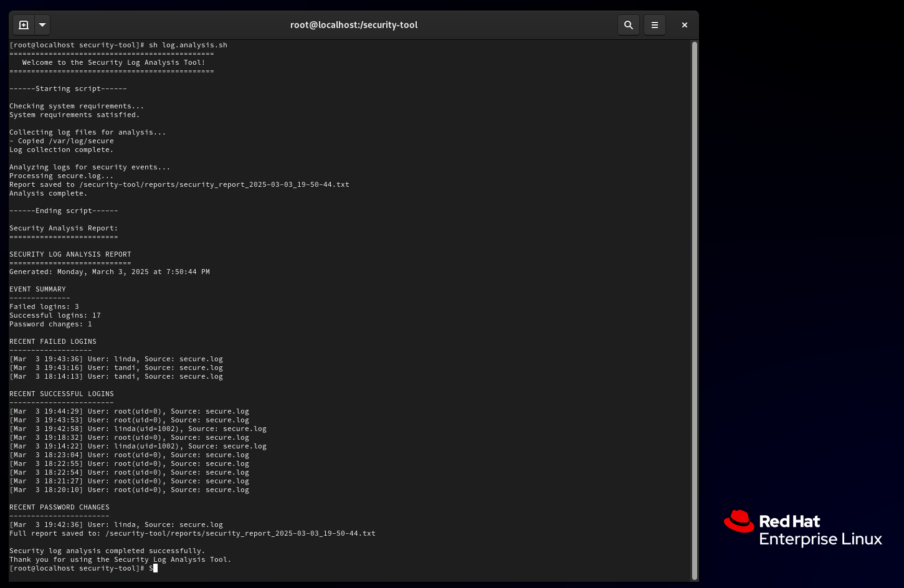

# Security Log Analysis Tool

## Overview

This tool analyzes and parses security logs to get authentication-related events including successful logins, failed logins and password changes, and organizes them into a report. You can run this on your RHEL machine to track these events and generate reports.

It can be run on your existing logs, or you can specify file paths in the command line for it to analyze and create it's own log file. 

### Script Execution and Report Generation

The report is printed in the terminal and saved in a defined file path when the script runs.




<br>

### Script Execution with Command Line Arguments and Log Creation

These images show script execution with another log file passed as an argument. When this happens, a new log file is created and saved, which contains the contents of the log file that was passed as an argument.


<br>

### Using this tool

To use this tool, you need to install Node.js. The script will throw an error if it is not installed. 


Command to run the script:

```bash
sh log_analysis.sh
```
